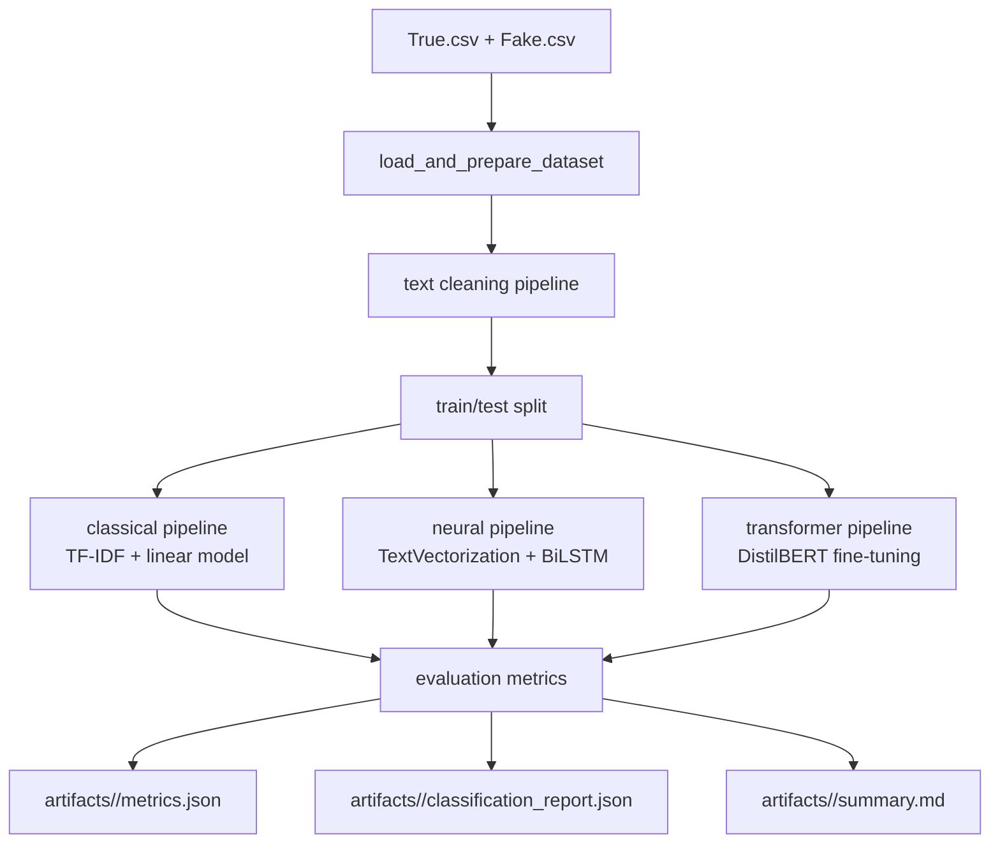

# Architecture

## Goal

This project is organized around one core idea: separate exploratory analysis from production-quality experimentation. The original notebook was useful for discovery, but maintainable research work needs isolated responsibilities and repeatable runs.

## System Flow

## Design Choices

### 1. Config-Driven Experiments

Each run is defined by a YAML file. This keeps preprocessing, model choice, and artifact locations explicit and reproducible.

### 2. Separate Modeling Families

The notebook mixed TF-IDF-derived features with LSTM architectures, which represent different input assumptions. This repository splits them into:

- a classical sparse-text path for interpretable baselines
- a sequence-model path for deep learning experiments on raw text
- a transformer fine-tuning path for stronger contextual representation learning

### 3. Reusable Evaluation

All experiments report the same metrics:

- accuracy
- precision
- recall
- F1
- ROC-AUC
- confusion matrix
- class-wise classification report

### 4. Research-Ready Outputs

Every training run writes machine-readable and human-readable artifacts so results can be compared, shared, and included in a portfolio.

## Module Responsibilities

- `config.py`: load YAML or JSON experiment definitions.
- `data.py`: read raw CSVs, create labels, merge text fields, and split datasets.
- `preprocessing.py`: deterministic text cleaning helpers.
- `classical.py`: TF-IDF plus baseline estimators.
- `neural.py`: optional TensorFlow-based sequence model.
- `transformer.py`: optional Hugging Face fine-tuning workflow for DistilBERT-style models.
- `metrics.py`: standardized evaluation and artifact generation.
- `pipeline.py`: orchestrate end-to-end experiment execution.
- `scripts/train.py`: command-line entrypoint.
